# LLM Aggregator

## What problem this solves

Most people only talk to one chatbot at a time. You open ChatGPT, or Claude, or Gemini, and you ask your question there. You rarely see how the same prompt performs across different models, because opening five tabs and copying the same text five times is slow and annoying. When a new free model shows up somewhere, most people never even try it, because there is no easy way to test it against something they already trust.

This project fixes that problem in one page. You type a prompt once. The app sends it to several models at the same time and shows every answer side by side, along with how long each one took. If enough answers come back, the models then grade each other. Each model reads the other answers and gives a score and a short comment. You get a quick, blind read on which answer was actually the strongest, not just which model has the biggest name.

The same idea applies to image generation. You type one description, and the app asks several image providers to draw it at once, so you can compare the results in one place instead of guessing which tool might do a better job.

The app also connects to real paid APIs from Anthropic, OpenAI, and Google, alongside a large set of free community providers. A logged in user gets a small free trial of these paid models, so you can compare a free provider against a real frontier model without needing your own key. If you already have your own key, you can enter it once and use it directly.

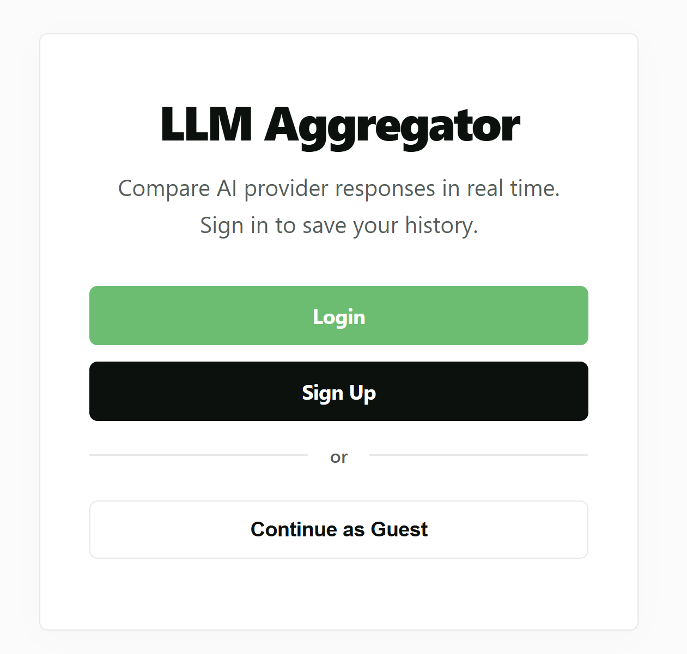

## Features

### Compare many models at once

When you submit a prompt, the backend calls every checked provider at the same time using a thread pool, so one slow provider never blocks the rest. Every answer comes back with its own response time, and the fastest successful answer is shown first. You can pick from a long list of free providers with no API key required, or check any of the frontier cards for Claude, ChatGPT, or Gemini.

### Blind peer review

Once every checked provider has answered, the app asks each successful model to read the other successful answers and score them, without knowing which model wrote which answer. This works across both free and paid models together, so a free provider can end up scoring higher than a paid one if its answer is genuinely better. A review that fails to come back cleanly is simply left out, instead of showing a fake score.

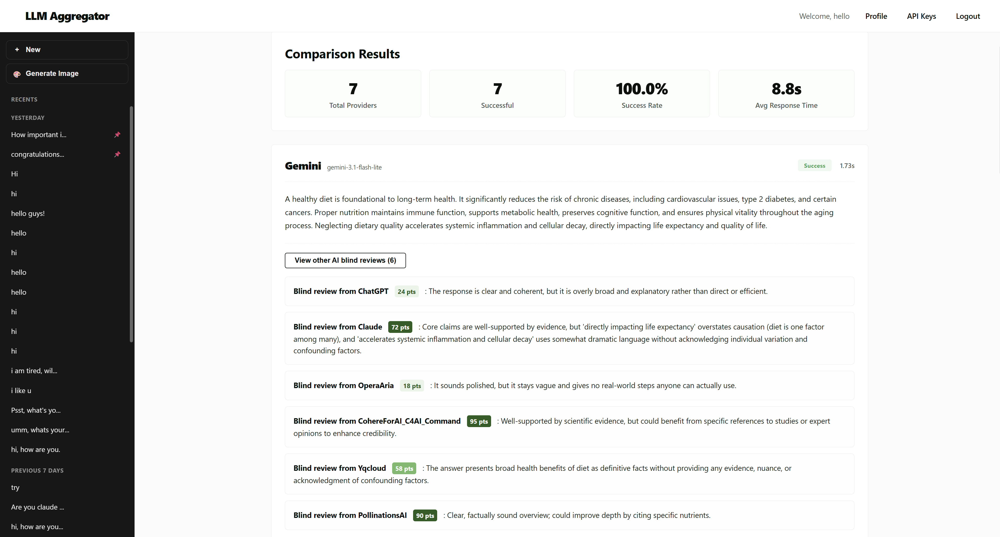

### Frontier models with a free trial

Claude, ChatGPT, and Gemini are wired in as first class providers, not an afterthought. Each one gets its own small free quota per account, tracked and shown as a pill in the navbar, so you always know how many free calls you have left before you spend your own money.

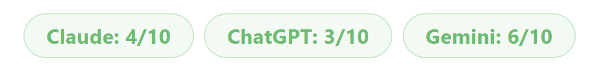

### Frontier only mode

If you only care about the paid models and want to skip the free providers entirely, one toggle locks out every free checkbox and only runs the frontier providers you picked.

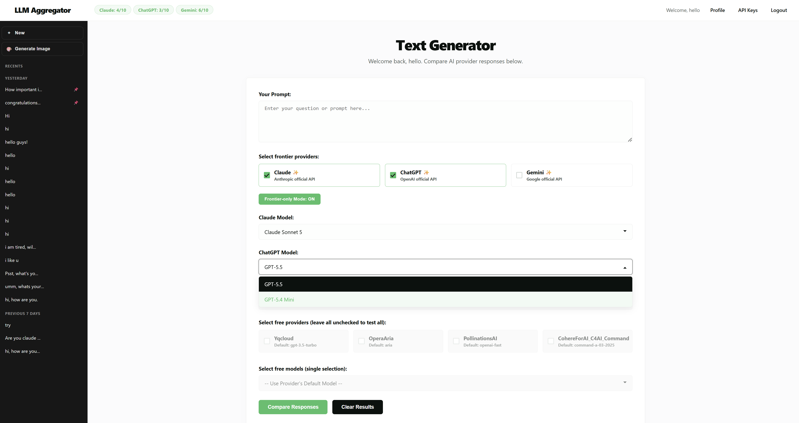

### Bring your own key

If you already pay for Claude, ChatGPT, or Gemini yourself, you can save your personal key in the browser on the API key page. Every request then uses your own key instead of the shared trial quota, and the key is never stored on the server.

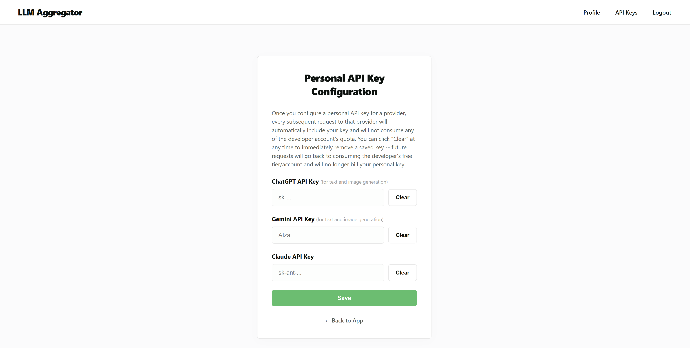

### Text to image comparison

The same side by side idea works for image generation. Type one prompt, and several free image providers plus the paid Gemini and ChatGPT image tiers generate a picture from it at the same time, so you can pick the result you like best.

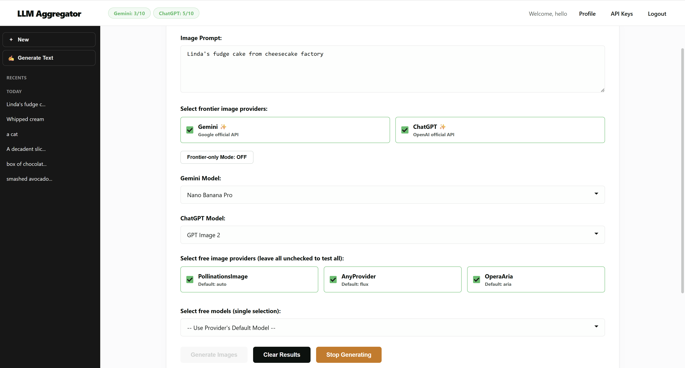

### History you can manage

Every comparison you run gets saved to your account, both for chat and for image generation, in two separate lists. You can pin a favorite result to the top, rename it, delete it, or page through older ones from the sidebar.

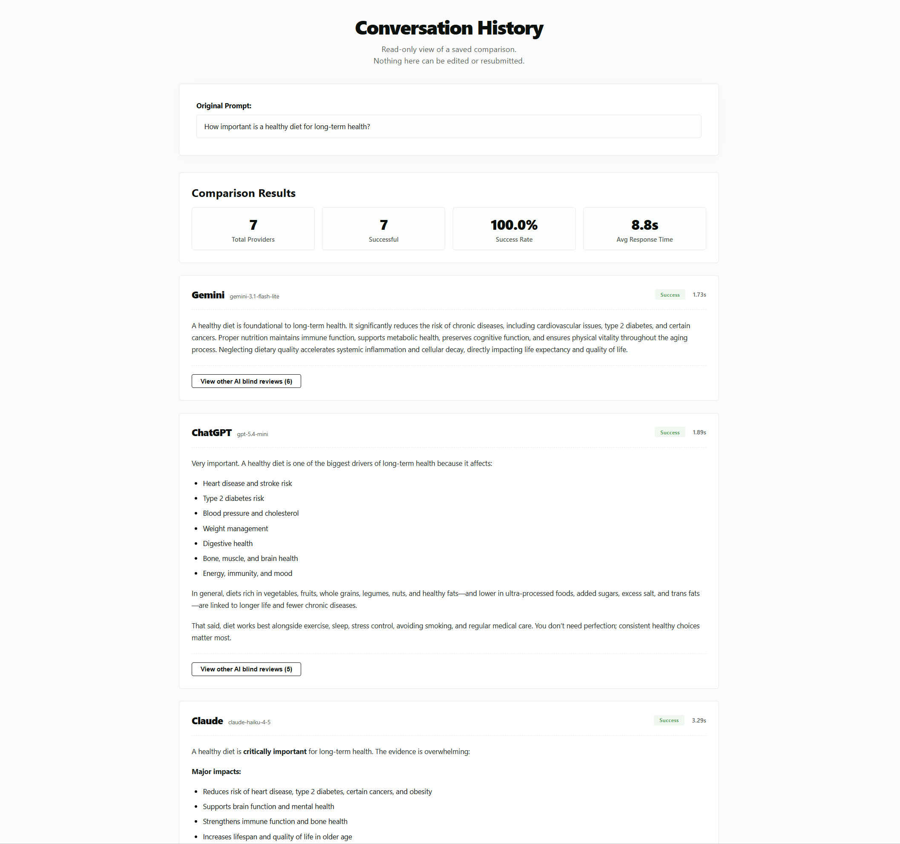

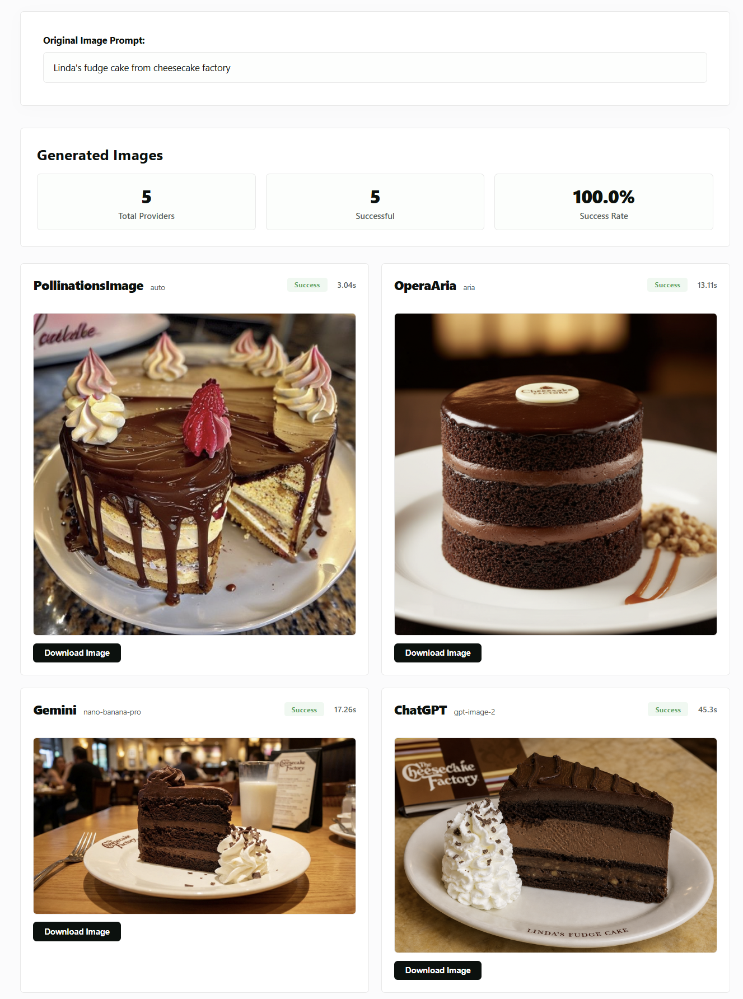

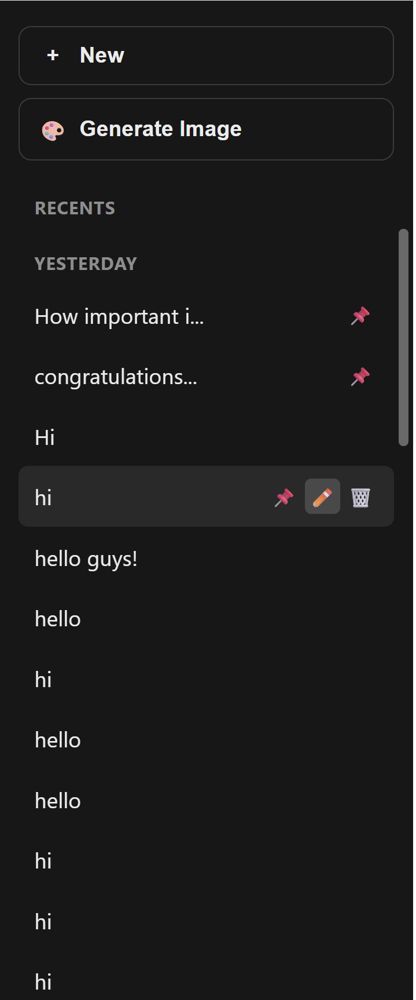

### Guest mode

If you do not want to create an account, you can continue as a guest. You still get the full chat comparison experience, and your history is kept in the browser for that session only. Image generation and the frontier paid models are reserved for full accounts, since those cost real money to run.

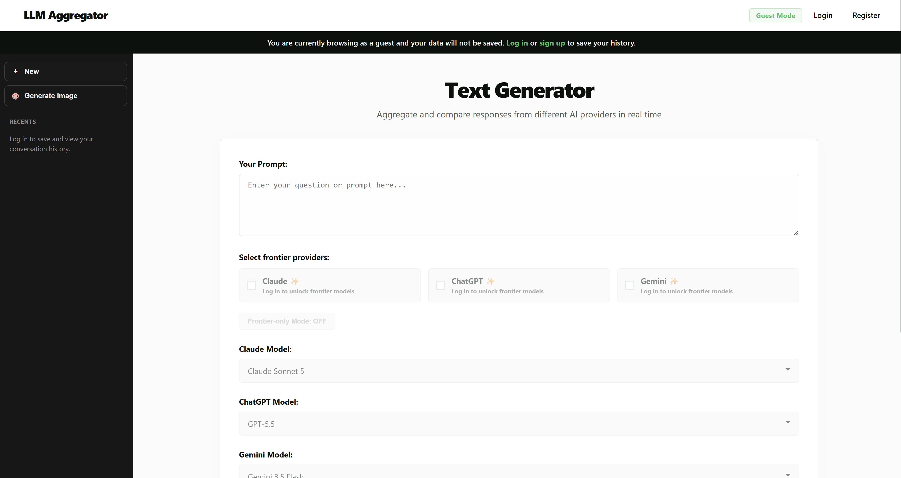

### Accounts and profile

A normal username and password system handles login and registration, and a simple profile page shows your account details.

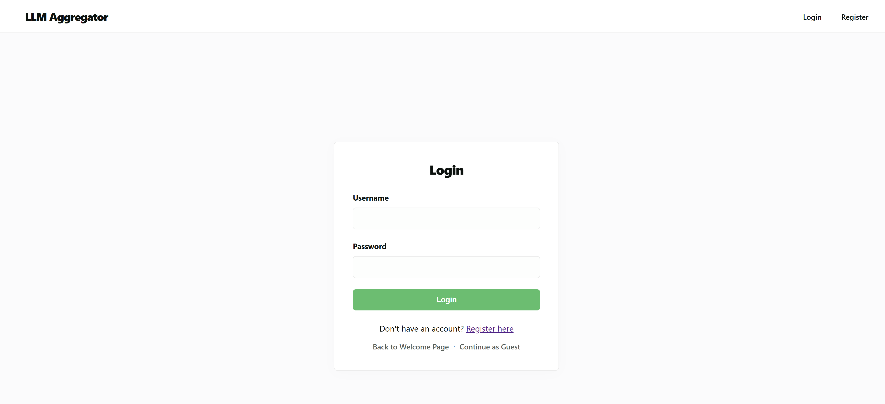

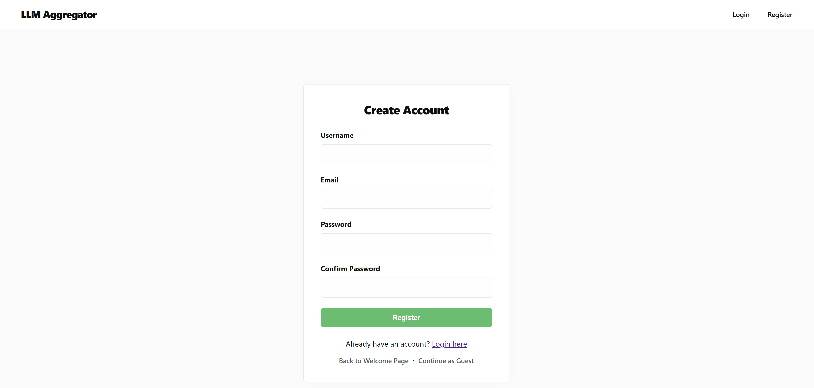

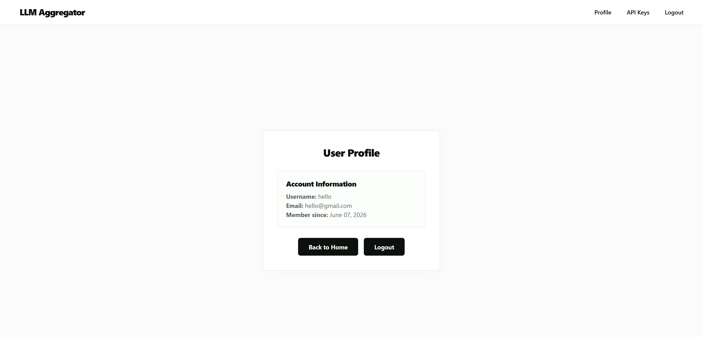

## Tech stack

The backend is written in Python with Flask, and concurrency is handled with a thread pool so multiple providers can be called at once without one slow request blocking the others. The free model calls go through the g4f library, which wraps a large number of community providers behind one interface. The three paid integrations use their own official SDKs directly: the `anthropic` package for Claude, the `openai` package for ChatGPT, and the `google-genai` package for Gemini.

User accounts, chat history, and image history all live in Google Cloud Firestore, accessed through the Firebase Admin SDK. Passwords are hashed with Werkzeug, and login state is carried in a normal Flask session.

The frontend is plain HTML, CSS, and JavaScript. There is no frontend framework and no build step. Pages are rendered with Jinja2 templates, and the page talks to the backend only through fetch calls.

The app is built to deploy on Google App Engine, and the deploy setup is kept deliberately simple: one `app.yaml` file and one deploy command, with no extra pipeline or secret manager.

## Quick start

Clone the repository, then set up a virtual environment and install the dependencies.

```bash
python3 -m venv env
source env/bin/activate
pip install -r requirements.txt
```

You need a Firebase project with a service account key saved locally as `firebase-key.json` in the project root, since chat history, image history, and accounts all depend on Firestore. You also need a `.env` file with a fixed `SECRET_KEY`. Adding `ANTHROPIC_API_KEY`, `GEMINI_API_KEY`, and `OPENAI_API_KEY` is optional. The app still starts without them, and only the matching frontier provider fails when you actually try to use it.

```bash
python main.py
```

The app runs on port 8080 by default. Open `http://localhost:8080` in your browser, and check `http://localhost:8080/health` to confirm the server is up.

## Highlights and technical challenges

Running several providers at once sounds simple, but each free provider fails in its own way, at its own pace, and for its own reasons. The project spent real effort on classifying these failures correctly, so a content moderation block is never retried as if it were a network hiccup, and a resource quota error on image generation is never retried at all, since retrying it only wastes time and adds load to an already tight pool.

Blind peer review turned out to be harder to make reliable than to build in the first place. With several models reviewing several other models at once, a handful of free providers would get hit with a burst of requests and start returning rate limit errors. The fix combines a small retry budget with growing wait times, a lock that stops the same rate limited provider from being hit by a whole batch of review requests at once, and a JSON parser that can pull a valid score out of a messy response even when a model second guesses itself mid answer. A review that still fails after all of that is simply hidden, since showing a fake fallback score is worse than showing nothing.

Saving image results into Firestore hit a hard limit that is easy to miss during local testing. Firestore rejects a document once a single embedded value gets too large, and a base64 encoded image easily crosses that line. The fix decodes the image once, writes it to a local file, and stores a link instead of the raw bytes. This ran into a second problem after the first real deploy, because Google App Engine's standard environment only allows writes inside the system temp folder, not the working directory that works fine on a laptop. Once local storage was pointed at the temp folder, both problems went away together.

Letting a user cancel a request mid-flight, without losing track of quota or history, needed its own small bit of bookkeeping. A short lived, in memory ledger remembers which requests were cancelled and which quota increments still need to be refunded, so clicking stop never leaves a paid quota unit stuck as spent, and never leaves a half finished result sitting in your history by mistake.
